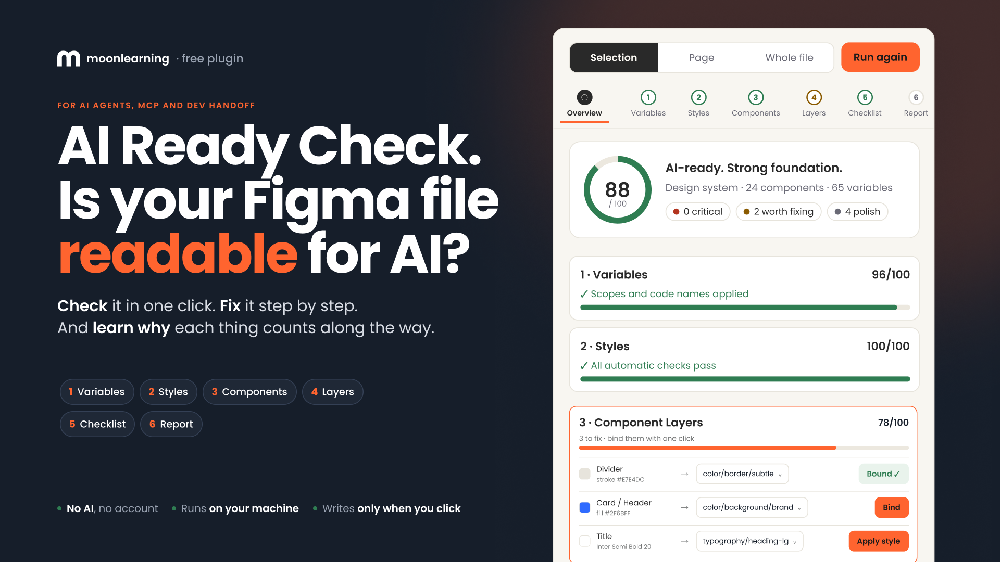

# AI Ready Check · Figma plugin (beta)

A free Figma plugin that checks and fixes your Figma file for AI agents, MCP and dev handoff, step by step. For designers who do not have access to the codebase and want to get the file in order anyway.

It walks you through six stations:

1. **Variables**: primitives and semantics, scopes, code names.
2. **Styles**: a named type scale.
3. **Components**: descriptions, properties, states.
4. **Layers**: tokens applied, auto-layout, names.
5. **Checklist**: what only a person can check, saved in the file for the whole team.
6. **Report**: a plain-text summary for your developers.

Every station explains why it matters, every check has a "?" that says why an agent cares, and most findings come with a one-click fix: bind a raw colour to its token, apply a matching text style, set scopes and code names for all tokens, write a component description from a draft.

Runs entirely on your machine. No AI, no account, no network. It only writes to the file when you click, and every change is one Cmd+Z.

## Install (beta, Figma desktop app)

1. Download this repository (green **Code** button → **Download ZIP**) and unzip it, or clone it.
2. Open the Figma **desktop** app (local plugins cannot be imported in the browser).
3. Menu → **Plugins → Development → Import plugin from manifest…**
4. Pick `ai-ready/manifest.json`.
5. Run it from **Plugins → Development → AI Ready Check**, or simply pick it from the Plugins menu once it is installed.

Try it on a copy of your file first. The checks are heuristics, not a verdict, and this is a beta.

## Safety, privacy and liability

**What it can and cannot do to your file.** The plugin cannot reach the internet, so nothing you have can leave your computer: no server, no analytics, no AI service. It only ever changes your file when you click a button, and every change is one Cmd+Z. It never deletes anything. Your team library is read, never written. The one thing it stores is the checklist, as plugin data in your own file.

**Confidential files.** You can use it. It reads only what Figma already shows you. If your company reviews plugins before use, this repository is the full source, so your security team can read exactly what it does, decide, and even change things to your needs. And as with any plugin, if your organisation's policy says no third-party plugins, that policy wins.

**Liability.** This is a beta, provided as is, without warranty of any kind. The checks are heuristics and can be wrong. You use it at your own risk: review each suggestion before you apply it, work on a copy if the file matters, and keep Figma's version history on. The author is not liable for any loss or damage arising from its use. See [LICENSE](LICENSE).

## Feedback

Wrong result, a bug, or an idea? Mail **hello@moonlearning.io**. A screenshot of the check that was wrong, and what you expected, is the most useful thing you can send.

## What is in here

- `ai-ready/` – the plugin: `manifest.json`, `code.js` (the audit and every fix), `ui.html` (the panel). Plain JavaScript, no build step. Details in [ai-ready/README.md](ai-ready/README.md).
- `tests/` – `node tests/run.js` runs the audit against fixture files with a small stand-in for the Figma API.
- `docs/` – cover and icon.

## Licence

Free to use, not to redistribute, provided as is without warranty. See [LICENSE](LICENSE). Not affiliated with Figma.

Made by [Christine Vallaure](https://christinevallaure.com), [moonlearning.io](https://moonlearning.io).
